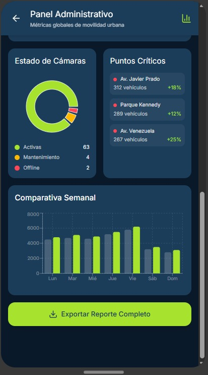
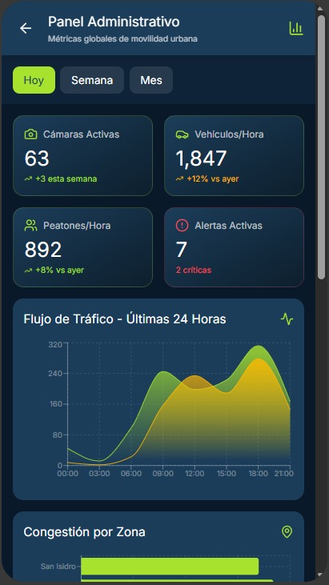

# 🖥️ Panel Administrativo — Veyro

El **panel administrativo web** está diseñado para municipalidades y gestores de tráfico.  
Permite visualizar:
- Métricas globales de movilidad  
- Gráficos por zonas y horarios  
- Estado de cámaras y sensores  
- Alertas activas y reportes exportables  

El diseño es **limpio, profesional y responsivo**, combinando gráficos dinámicos con íconos de estado en tiempo real.  
Representa la **inteligencia urbana de Visiora** desde una vista de control central.

